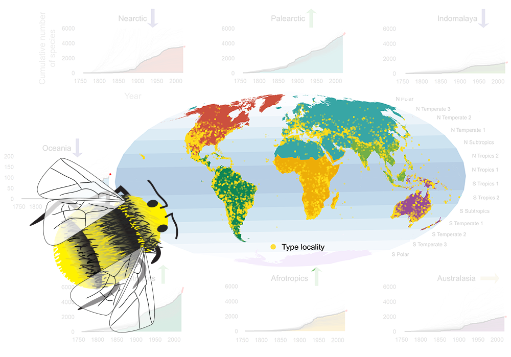

# Global trajectories of bee discovery

Eunice Jia Yu Soh, Luis Roman Carrasco, John Stoskopf Ascher*

*corresponding author: dbsajs@nus.edu.sg





---

## Introduction

Code for the paper **Global trajectories of bee discovery** which you may use for your own dataset. Model code was adapted from [Edie et al. (2017)](https://github.com/sedie/bayside) and diagnostic code was adapted from [@betanalpha](https://github.com/betanalpha/knitr_case_studies/blob/master/rstan_workflow/stan_utility.R).

## Environment setup

- Clone (using git)/download this repository to your workspace
- Install [RTools](https://cran.r-project.org/bin/windows/Rtools/history.html) which is required for RStan
- Install all libraries specified in `code/libraries.r`, including RStan. You may create a new library folder (if you don't wish to mess up your existing R libraries):

```r
.libPath(c('<your new library path>', .libPaths())) # add to front
install.packages(c(<packages to install>))
```

To revert to original library:

```r
libs <- .libPaths()
.libPaths(libs[2:length(libs)]) # removing the 1st/new library
```


## How to: general overview

- Add input data

- Run numbered steps sequentially `01-model.r` must be run first before `02-forecast.r` or `03-evaluate.r` but
- Files are persisted so dependent scripts (e.g. `02-forecast.r`) may be run in the future without having re-run `01-model.r`
- Some results are output as artifacts (`.csv`, `.pdf` files) others are printed to console.


## Input data format

- For `data/data.csv`

```csv
valid_species_id,year,group
1,1878,NA
2,2004,NT
3,2004,NA
4,1869,NT
5,1861,NT
6,1966,NA
```

Description: species data. Each row is one species.

- `valid_species_id`: unique integer identifier for species
- `year`: year in which species was described/ "discovered"
- `group`: group in which the species belong to. Group may be a region (e.g. biogeographic realm) or a taxonomic rank (e.g. family)

- For `data/offset.csv` (**OPTIONAL**)

This file is optional. If not provided, offset matrix will contain zeroes.

```csv
year,group,N
1758,NA,0
1759,NA,0
1760,NA,0
1761,NA,0
1762,NA,0
1763,NA,0
1764,NA,0
```

Description: aggregated offset data (by publication or by describer, or any other metric of taxonomice effort) summarised by year

- `year`: year for taxonomic effort metric
- `group`: group for taxonomic effort metric
- `N`: number of units of units of taxonomic effort 


## How to: run the model

- Edit `model_params` in `params.r`
- Open R and run the following:

```r
source('01-model.r')
```
- Model fit and posterior simulation will be output into `model/`

note: using the sample data (`data.csv` and `offset.csv`) with Intel Xeon W-2125 Processor with 32 GB RAM (tree depth 12, 4 chains), the duration increased with iterations or adapt delta hyperparameter changes:

| Iterations | Adapt delta | Duration |
|------------|-------------|----------|
| 20000      | 0.9         | ~2 hours |
| 100000     | 0.9         | ~8 hours |

## How to: forecast using the model

- Edit `forecast_params` in `params.r`
- Open R and run the following:

```r
source('02-forecast.r')
```
- Forecast simulation will be output in `model/forecast/`

note: different forecasting windows will be output into the same folder (`model/forecast`) but with different filenames indicating the duration of forecast (in years).

## How to: evaluate the model

- Open R and run the following:

```r
source('03-evaluate.r')
```
- Model diagnostics and model fit (LOOAIC) will be printed out in the R console.

## Folder structure and important files

- `data/`: where data should be added. Two important files required: `data.csv` and `offset.csv`. Sample data provided are `data-example.csv` and `offset-example.csv` which may be renamed to `data.csv` and `offset.csv` respectively to test out the model.
- `01-model.r`: modelling code which calls code from `code/model/`
- `02-forecast.r`: modelling code which calls code from `code/forecast/`
- `03-evaluate.r`: modelling code which calls code from `code/evaluate/`
- `code/`: 
  - `code/model/`: code for running the rstan model
  - `code/evaluate/`: model evaluation code (diagnostics and model fit using LOOAIC) 
  - `code/validate/`: model time series validation code to decide on appropriate window for forecasting
- `model/`: where model artifacts are persisted, including
  - `model/count_info_ref.data.R`: data for in validation
  - `model/count_info.data.R`: data for modelling
  - `model/fit.data`: model fit
  - `model/post.data`: posterior samples (count data)
  - `model/forecast-<X>-yrs.data`: posterior forecast (count data) for `X` number of years into the future from the last date. Recommended to use 10 years.
  - `model/warnings.log`: warnings logged from `01-model.r`. May include stan warnings.
  - `model/model.log`: model log, including model parameters and duration taken to run the stan model
  - `model/results/*`: visualisations and summarised results (`csv` files)
